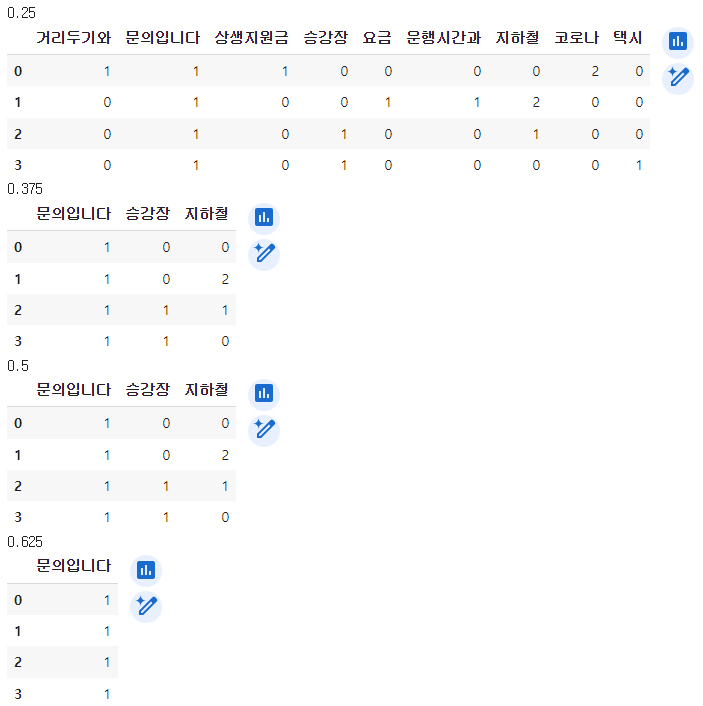

- corpus: 말뭉치
- document: 문서

corpus는 문서 여러 개를 포함할 수 있다.
# CountVectorizer
## max_df / min_df
- 토큰이 문서 내 등장한 것(document frequency)을 기준으로 한 corpus의 비율 / 횟수를 비교해서 parse한 결과에 포함시킬지 결정
    - float: 비율
    - int: 횟수
- 해당 비율 / 횟수 기준으로 이보다 많은(적은) 문서에 등장했다면 결과에 포함하지 않는다.
- 문서 내 몇 회 등장했는지 상관 없다. 1회 이상 등장하면 해당 문서는 이 비율 / 횟수 비교에 포함된다.
```python
import pandas as pd
import numpy as np
from sklearn.feature_extraction.text import CountVectorizer

corpus = ["코로나 거리두기와 코로나 상생지원금 문의입니다.",
        "지하철 운행시간과 지하철 요금 문의입니다.",
        "지하철 승강장 문의입니다.",
        "택시 승강장 문의입니다."]

for ratio in np.linspace(0, 1, 9):
    print(ratio)
    cvect = CountVectorizer(min_df=ratio, max_df=5)
    dtm = cvect.fit_transform(corpus)
    vocab = cvect.get_feature_names_out()
    df_dtm = pd.DataFrame(dtm.toarray(), columns=vocab)
    display(df_dtm)
```


`min_df`로 보자면
- 0.25면 문서 4개 중 하나에만 있으면 되기 때문에 모든 단어 포함됨.
- 0.375와 0.5는 0.25보다 크기 때문에 두 개 이상의 문서에 단어가 있어야 포함됨.
- 0.75는 세 개 이상의 문서에 단어가 포함되어야 함.

# TFIDF
- TF(term frequency): 문서 내 term(token)이 얼마나 자주 나타나는지. 문서마다 횟수를 세기 때문에 각각의 문서마다 값이 다를 수 있음.
- DF(document frequency): 위에서 다룬 문서 빈도. 값이 클수록 여러 문서에 걸쳐 이 term(token)이 발견된다.
    - 위에서 언급한 내용을 TF랑 비교해서 정리하자면, TF처럼 단어 등장 횟수에 따라 계산되는 것이 아니라 단어가 어떤 문서 내에 한 번 이상 등장한다면 전체 문서 개수에 대해 이 문서에 대해 count가 추가된다.
- IDF(inverse document frequency): 위의 *역수*. 값이 클수록 여러 문서에 걸쳐 희소성이 높다.
    - *역수* 그대로 사용한다면 숫자 범위가 너무 커질 수 있기 때문에 로그 스케일을 적용한다.
- TF-IDF: TF와 IDF를 곱함. 각 문서마다 계산하며, IDF는 corpus에 대해 계산하기 때문에 희소성을 나타내고, 이를 TF와 곱한다면 특정 문서에서 이 단어가 얼마나 등장하는지에 대한 척도라고 생각할 수 있다.
    - 이 값이 높다면 이 문서에 대해 이 단어가 자주 등장하고, 따라서 이 문서 내에서는 중요도가 높다고 생각할 수 있다.
    - 이 값이 작다면 이 문서에 대해서는 단어가 등장하기는 하지만
        - corpus에서 여러 문서에 걸쳐 이 단어가 등장할 수 있고
        - 이 문서에서 단어가 몇 번 등장하지 않을 수도 있다.

코랩 수식 notation
$$ \text{tfidf}_{w, d} = \text{tf}_{w, d} \times \text{idf}_w = N_{w, d} \times \left( \ln \left(\frac {N + 1} {N_w + 1} \right) + 1\right) $$
- $N_{w,d}$: 문서 $d$에 대해 토큰 $w$의 개수
- $N$: corpus 내 문서 개수
- $N_w$: token $w$가 포함된 문서의 개수

Normalization 적용하지 않으면 저대로 계산된다.

코랩 추가정보 idf 부분 먼저 보면 이해하기 수월함.

# sklearn tfidfvectorizer
- `TfidfVectorizer`는 `CountVectorizer`에다가 `TfidfTransformer` 적용한 것과 같음
- `TfidfTransformer`는 어떤 식으로 이미 생성한 횟수 기반의 매트릭스에 적용할 수 있음